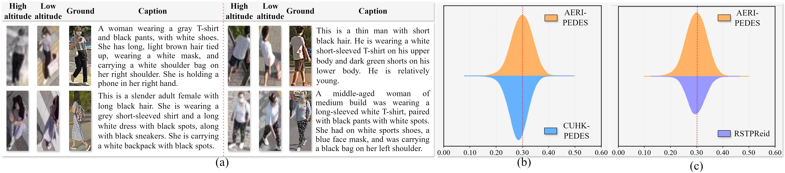
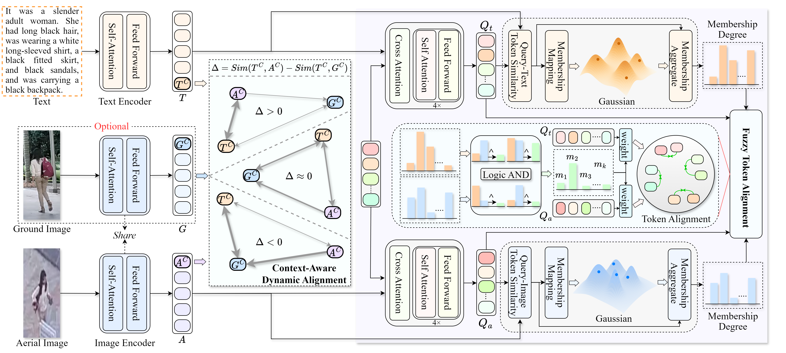

# Cross-modal Fuzzy Alignment Network for Text-Aerial Person Retrieval and A Large-scale Benchmark

Official Benchmark and PyTorch implementation of the paper Cross-modal Fuzzy Alignment Network for Text-Aerial Person Retrieval and A Large-scale Benchmark. (CVPR 2026) [arXiv](https://arxiv.org/abs/2603.20721)

Our recent work:

> **“Cross-modal Fuzzy Alignment Network for Text-Aerial Person Retrieval and A Large-scale Benchmark”**  
> has been **accepted by CVPR 2026** 🎉.

This repository includes more than this single paper, but AERI-PEDES and TBAPR are important components released here.

---

## 🔔 News
- **2026.04** – **AERI-PEDES** dataset is available for download.
- **2026.02** – Our **Cross-modal Fuzzy Alignment Network for Text-Aerial Person Retrieval and A Large-scale Benchmark** is accepted by **CVPR 2026**.   
---

## 📦 AERI-PEDES Dataset (A Large-scale Text-Aerial Person Retrieval Dataset)



The images of our dataset are constructed based on three existing Aerial-Ground Person-ReID image datasets: [AG-ReID.v2](https://github.com/huynguyen792/ag-reid.v2), [G2APS](https://github.com/yqc123456/HKD_for_person_search) and [AG-VPReID](https://github.com/agvpreid25/AG-VPReID).

We adopt a joint filtering strategy combining VLM and human annotation, removing identity samples with unclear or hard-to-describe pedestrian targets in ground views, as well as severely blurred or unrecognizable images in aerial views.

You can download the AERI-PEDES dataset from Baidu Netdisk:
       Link: https://pan.baidu.com/s/1v5qVZTnuKiTT8jk0R4o2PA 
       Password:  cs8a

**Notes**: In the link above, we do not fully release all caption annotations. This is because, during our experiments, we found that using the complete set of captions leads to an excessive number of diverse textual descriptions for the same image, which introduces noise and negatively affects model training. Therefore, we perform selection and normalization only on the training set, reducing redundancy while preserving diversity, resulting in the released JSON file; the test set remains unchanged.

It is worth noting that, compared to the full version, the number of person IDs and images remains the same, and only the number of captions in the training set is reduced. 

**We recommend that future work conduct experiments based on this JSON file to ensure fair comparisons.** 
If you require the full set of annotations, please feel free to contact us via email, and we will provide the complete JSON file.

## 📦 TBAPR Dataset (The First Text-Aerial Person Retrieval Dataset)

Download the TBAPR dataset from [here](https://github.com/xbdxwyh/AEA-FIRM-main)

## 📚 Methods



## 📚 Citation
If you find this code useful for your research, please cite our paper.

```tex
@article{deng2026cross,
  title={Cross-modal Fuzzy Alignment Network for Text-Aerial Person Retrieval and A Large-scale Benchmark},
  author={Deng, Yifei and Li, Chenglong and Zhang, Yuyang and Hu, Guyue and Tang, Jin},
  journal={arXiv preprint arXiv:2603.20721},
  year={2026}
}
```
