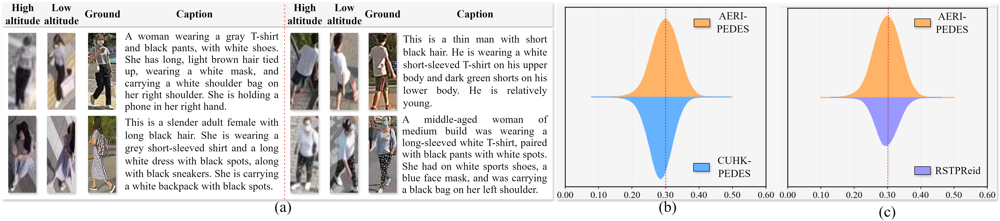
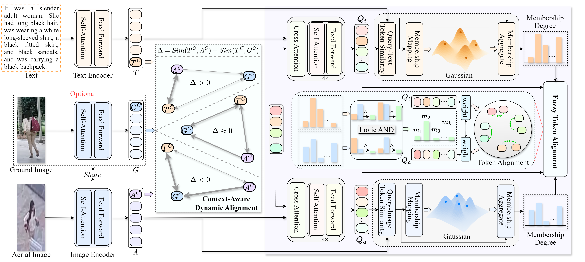

# Cross-modal Fuzzy Alignment Network for Text-Aerial Person Retrieval and A Large-scale Benchmark

Official Benchmark and PyTorch implementation of the paper Cross-modal Fuzzy Alignment Network for Text-Aerial Person Retrieval and A Large-scale Benchmark. (CVPR 2026) [arXiv](https://arxiv.org/abs/2603.20721)

In the meantime, check out our related papers if you are interested:

🎉【**TIFS 2026**】 Cross-modal Person Retrieval with One-to-Many Relation Modeling, TIFS 2026, Yifei Deng et al., [[PDF](https://ieeexplore.ieee.org/abstract/document/11503671)]

🎉【**ACM MM 2025**】 Learning Hierarchical Cross-modal Association with Intra-modal Context for Text-Image Person Retrieval, ACM MM 2025, Yifei Deng et al., [[PDF](https://dl.acm.org/doi/epdf/10.1145/3746027.3754721)]

This repository includes more than this single paper, but AERI-PEDES and TBAPR are important components released here.

## 🔔 News
- **2026.05** – The code has been publicly released. 
- **2026.04** – **AERI-PEDES** dataset is available for download.
- **2026.02** – Our **Cross-modal Fuzzy Alignment Network for Text-Aerial Person Retrieval and A Large-scale Benchmark** is accepted by **CVPR 2026**.   

## 📦 AERI-PEDES Dataset (A Large-scale Text-Aerial Person Retrieval Dataset)



The images of our dataset are constructed based on three existing Aerial-Ground Person-ReID image datasets: [AG-ReID.v2](https://github.com/huynguyen792/ag-reid.v2), [G2APS](https://github.com/yqc123456/HKD_for_person_search) and [AG-VPReID](https://github.com/agvpreid25/AG-VPReID).

We adopt a joint filtering strategy combining VLM and human annotation, removing identity samples with unclear or hard-to-describe pedestrian targets in ground views, as well as severely blurred or unrecognizable images in aerial views.

You can download the AERI-PEDES dataset from Baidu Netdisk:

       Link: https://pan.baidu.com/s/1v5qVZTnuKiTT8jk0R4o2PA 
       Password:  cs8a

**Notes**: We release the complete set of caption annotations in **complete_caption.json**. During our experiments, we observed that directly training with the full annotations may lead to performance degradation. This issue mainly arises from semantic inconsistencies or mismatched correspondences within the triplets composed of (aerial image, ground image, textual description), which can interfere with effective model learning.

To address this problem, we perform sampling and normalization on the training split of the complete annotations, resulting in **train_caption.json**, which is used for training in our method. **This process only affects the training data and does not impact the test set.**

Importantly, the sampled training set preserves the same number of person IDs as the complete annotations, thereby maintaining identity distribution consistency while reducing redundancy and conflicts in textual descriptions.

**Users may choose to train models either with the full annotation file (**complete_caption.json**) or with our sampled version (**train_caption.json**), depending on their experimental needs.**

## 📦 TBAPR Dataset (The First Text-Aerial Person Retrieval Dataset)

Download the TBAPR dataset from [here](https://github.com/xbdxwyh/AEA-FIRM-main)

## 📚 Methods



## 📦 Code Released

The pretrained model weights have been uploaded and are available for download via Baidu Netdisk for testing purposes：

       AERI-PEDES CheckPoint:
       Link: https://pan.baidu.com/s/1rJRaTZsXoMHUjkSp52rh7w 
       Password:  mjcq

|     Method      |  Rank-1   |  Rank-5   |  Rank-10  |    mAP    |   RSum    |
| :-------------: | :-------: | :-------: | :-------: | :-------: | :-------: |
| **CFAN (ours)** | **47.158** | **65.657** | **73.799** | **44.793** | **186.615** |

       TBAPR CheckPoint
       Link: https://pan.baidu.com/s/1U0y-vAT8cVPGVp9t-41hAw 
       Password: 8963

## 📚 Citation
If you find this work useful for your research, please consider cite our paper.

```tex
@inproceedings{deng2026cross,
  title={Cross-modal Fuzzy Alignment Network for Text-Aerial Person Retrieval and A Large-scale Benchmark},
  author={Deng, Yifei and Li, Chenglong and Zhang, Yuyang and Hu, Guyue and Tang, Jin},
  booktitle={Proceedings of the IEEE/CVF Conference on Computer Vision and Pattern Recognition},
  pages={38732--38741},
  year={2026}
}
```
